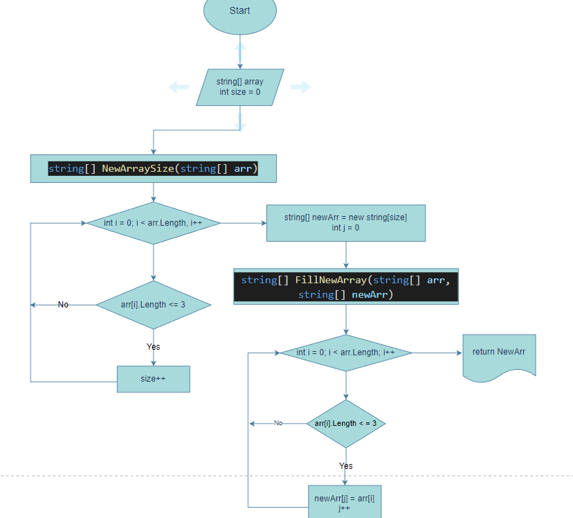

# Описание решения задачи

## Дана задача: 

Написать программу, которая из имеющегося массива строк формирует новый массив из строк, длина которых меньше, либо равна 3 символам. Первоначальный массив можно ввести с клавиатуры, либо задать на старте выполнения алгоритма. При решении не рекомендуется пользоваться коллекциями, лучше обойтись исключительно массивами.

---

### 1. Создание массива

Массив можно задать сразу или задать с клавиатуры. Чтобы задать массив с клавиатуры, необходимо попросить __пользователя__ ввести *длину* массива, а затем *элементы* массива(через запятую). 

---

### 2. Печать массива

После создания массива необходимо добавить метод __печати массива__. Он будет *универсальным* и подойдет также для печать нового массива.

---

### 3. Метод создания нового массива

Чтобы создать новый массив, необходимо проверить уже созданный массив на элементы, количество символов в котором меньше или равно 3 символам. Нам необходимо посчитать, сколько элементов подходит под условие. Для этого создадим __переменную__, которая будет содержать *количество* подходящих элементов, тем самым будет являться *длиной* нового массива. После прохождения всего массива, мы создаем __*новый массив*__, длина которого будет равно количеству, записанному в переменную.

---

### 4. Заполнение массива

После того, как мы создали массив с подходящей длиной, необходимо его заполнить элементами. Для этого нужно создать новую __переменную__, которая будет являться индексом нового массива. После этого начинаем проверять каждый элемент первого массива. Если длина элемента меньше или равна 3 символам, этот __элемент__ мы *присваиваем* элементу __*нового массива*__.

---

### 5. Блок-схема

Для лучшего понимания решения данной задачи, прикрепляю алгоритм решения.
